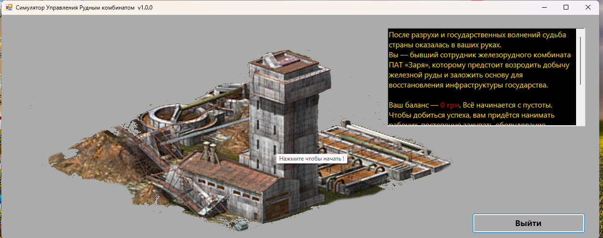
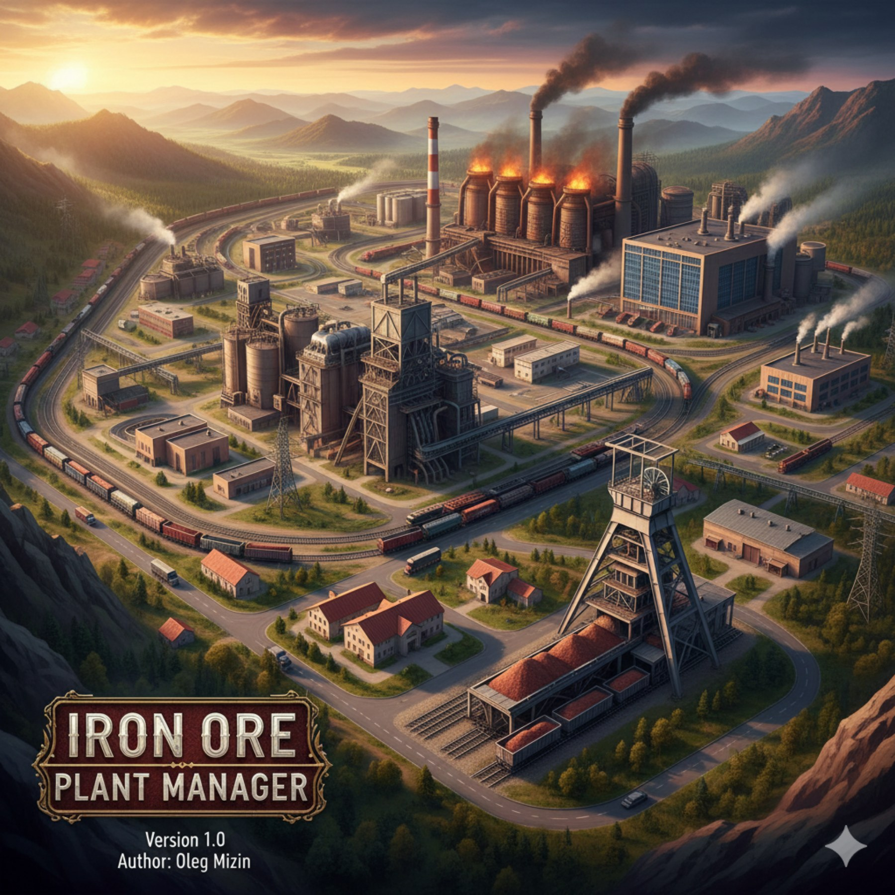

# Miner
# Комплекс — Business Simulator / Ore Plant Management

**Комплекс** — это бизнес-симулятор управления шахтой и переработкой ресурсов.  
Проект создан для демонстрации архитектуры модульных приложений, UI/UX-дизайна и бизнес-логики.

## 🚀 Возможности
- Управление шахтой и складом ресурсов
- Событийная система для синхронизации UI
- Современный интерфейс с тёмной темой и золотыми акцентами
- Аналитика и отчёты по производству
- Сохранение и загрузка прогресса

## 🛠️ Технологии
- **C# / .NET Framework**
- **Windows Forms**
- Событийно-ориентированная архитектура
- Модульная структура классов

## 📂 Структура проекта
- `Core/` — бизнес-логика и управление ресурсами
- `UI/` — интерфейс и панели управления
- `Analytics/` — отчёты и визуализация
- `SaveLoad/` — сохранение и загрузка прогресса
## 📸 Скриншоты




## 📦 Установка
```bash
git clone https://github.com/USERNAME/Complex.git
cd Complex

---

## ⚙️ .gitignore (для C# / Visual Studio)

```gitignore
# Build results
bin/
obj/
Debug/
Release/

# User-specific files
*.user
*.suo
*.userosscache
*.sln.docstates

# Visual Studio Code
.vscode/

# Backup and logs
*.log
*.bak
*.tmp

# NuGet
*.nupkg
packages/
